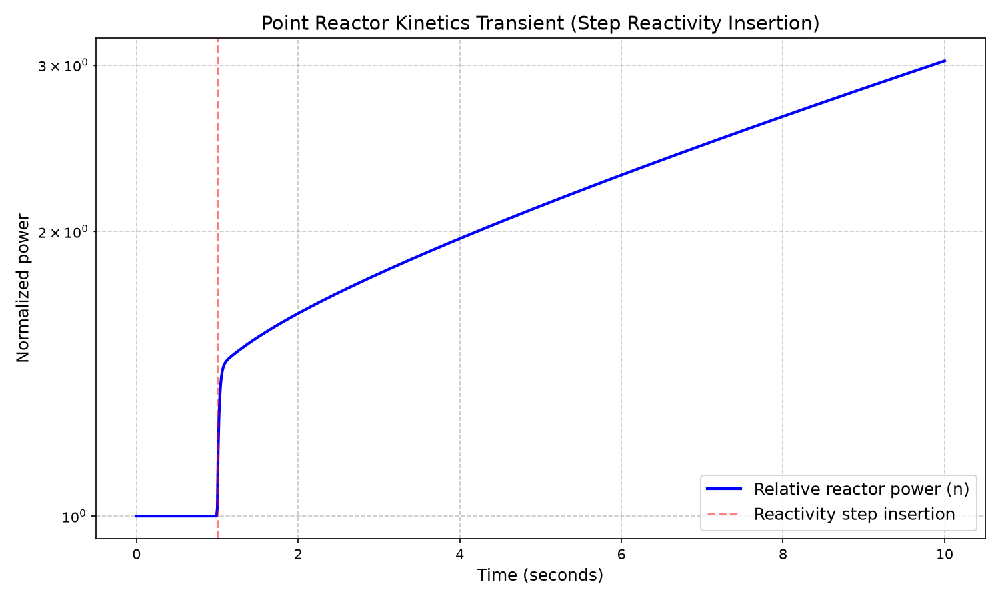

# Point Reactor Kinetics Solver
Status: Work in Progress 🚧

Welcome! I'm currently building this point reactor kinetics solver from the ground up. The core numerical solver, transient visualization, inline documentation, inhour verification, and Prompt Jump Approximation verification are now in place. Next up: adding a ramp reactivity insertion.

## Mathematical Model
The script (`point_kinetics.py`) solves the standard point kinetics equations for one prompt neutron group and six delayed neutron precursor groups:

$$\frac{dn}{dt} = \frac{\rho(t) - \beta_{total}}{\Lambda} n(t) + \sum_{i=1}^{6} \lambda_i C_i(t)$$

$$\frac{dC_i}{dt} = \frac{\beta_i}{\Lambda} n(t) - \lambda_i C_i(t)$$

After a step insertion, power doesn't ramp up smoothly
it jumps almost instantly (precursors can't respond on a 10⁻⁴ s timescale), then climbs
more slowly afterward on a period set by the precursor decay. You'll see this clearly on
the log-scale plot below.

**Note:** In the code, the variable `lambda_decay` refers to the array of precursor decay constants ($\lambda_i$ above), and `gen_time` refers to the prompt neutron generation time ($\Lambda$ above). We use `lambda_decay` instead of the single-letter textbook notation because `lambda` is a reserved keyword in Python. Keep that in mind when comparing the equations to the code.

## Current Implementation
- **Core Solver:** Solves the kinetics equations in Python, using `numpy` and `scipy`.
- **Stiff ODE Integration:** Uses `scipy.integrate.solve_ivp` with the `Radau` method to handle the stiffness (the prompt neutron generation time is ~10⁻⁴ s, while the delayed neutron precursors evolve over seconds).
- **Reactivity Insertion:** Models a step reactivity insertion ($\rho = 0.002$ at $t = 1$ s). This is roughly 30% of $\beta$ for U-235, simulating a controllable transient safely below the prompt critical threshold.
- **Steady-State Initialization:** Automatically sets the initial precursor concentrations so the system starts from a critical steady state ($n_0 = 1$).
- **Plotting & Visualization:** Uses `matplotlib` to graph the normalized reactor power versus time on a logarithmic scale, visually indicating the step insertion.
- **Analytical Verification (Inhour):** `Inhour_verification.py` solves the six-group model out to 60 s, finds the numerical reactor period, and calculates the percent error vs the root of the inhour equation (found via `scipy.optimize.brentq`). Currently agrees to within 0.21%.
- **Analytical Verification (Prompt Jump):** `Prompt_jump_verification.py` runs a short simulation to capture the almost instant power spike right after the step insertion and compares it against the analytical Prompt Jump Approximation. Currently agrees within 0.66%.
- **Detailed Documentation:** The code features conversational, beginner-friendly inline comments that explain the physics and mathematical reasoning behind the ODEs.

## Verification Results

### Inhour Equation
Running `Inhour_verification.py` with the default 200 pcm step gives:

| Quantity | Value |
|---|---|
| Reactivity step | 200.0 pcm |
| Analytical period (inhour root) | 17.404 s |
| Numerical period (fit, t ≥ 40 s) | 17.367 s |
| Percent difference | 0.213 % |

The six-group solver's asymptotic period agrees with the inhour equation to within 0.21%, confirming the ODE solver is behaving correctly in that timescale.

That remaining 0.21% isn't necessarily solver error. The inhour equation describes the *pure* asymptotic mode, but the actual transient is six exponential terms (one per precursor group), and the fastest still hasn't completely vanished by t = 40 s. Pushing the fit window later would lower the error even further.

### Prompt Jump Approximation
Running `Prompt_jump_verification.py` with the default 200 pcm step gives:

| Quantity | Value |
|---|---|
| Reactivity step | 200.0 pcm |
| Analytical n(0+)/n0 | 1.4442 |
| Numerical n(t=1.1s)/n0 | 1.4538 |
| Percent difference | 0.661 % |

The solver's immediate post-insertion power ratio agrees with the Prompt Jump Approximation within .66%, confirming the fast-timescale behavior of the solver is correct in addition to its long-term asymptotic behavior.

## What's Next?
- **Ramp Reactivity Insertion:** Extending `reactivity()` to support a linear ramp insertion

## Usage
To run the current solver, ensure you have `numpy`, `scipy`, and `matplotlib` installed and then run:
```bash
python point_kinetics.py
```
To run the inhour equation verification:
```bash
python Inhour_verification.py
```
To run the Prompt Jump Approximation verification:
```bash
python Prompt_Jump_Approximation.py
```

## Expected Output
Running the solver with the default parameters will generate a transient response plot and automatically save it to your directory as `step_response.png`.



## References
- J. J. Duderstadt, L. J. Hamilton, *Nuclear Reactor Analysis*, John Wiley & Sons, 1976.
  - (Tabel 2-3) - six-group delayed neutron data used in `point_kinetics.py`.
  - Chapter 6 - Six-group point kinetics equations in the normalized reactivity/generation-time form used in `point_kinetics.py`, acorresponding inhour equation in this same normalized form used in `Inhour_verification.py`, and Prompt Jump Approximation used in `Prompt_Jump_Approximation.py`.
